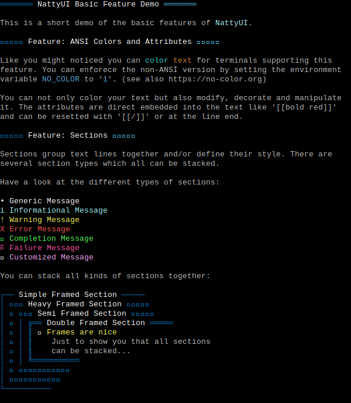

# NattyUI

This is the beautiful, nice, nifty, fancy, neat, pretty, cool, lovely, natty user interface you like to have for your command line interfaces (CLI).

<!-- TODO:  -->

<!-- TODO:
- Gem: [rubygems.org](https://rubygems.org/gems/natty-ui)
- Source: [github.com](https://github.com/mblumtritt/natty-ui)
- Help: [rubydoc.info](https://rubydoc.info/gems/natty-ui/NattyUI)
-->

## Description

Here you find elegant, simple and beautiful tools that enhance your command line application functionally and look.

You can simply decorate your text with named ANSI attributes and colors

```ruby
UI.puts "[[bold]]Hello [[ff7bfd]]World[[/]]!"
```

or use different types of messages

```ruby
UI.info 'NattyUI installed'
UI.warning 'Nice gem found!'
```

and headings

```ruby
UI.h1 'The Main Title (TMT)'
UI.h2 'A Subtitle'
```

and framed sections

```ruby
UI.framed 'Text Below In Frame' do |framed|
  framed.puts 'This is the text'
end
```

or use progression displays like progress bars and much much more!



<!-- TODO:
https://raw.githubusercontent.com/mblumtritt/natty-ui/main/examples/illustration.svg
-->

### But there is more!

Have a look at the [examples](./examples/) directory to get an impression of the current feature set.

```sh
ruby ./examples/basic.rb
```

or see the non-ANSI version

```sh
NO_COLOR=1 ruby ./examples/basic.rb
```

<!-- TODO:
link to NattyUI Features for more features!
 -->

### NO_COLOR Convention

NattyUI follows the [NO_COLOR convention](https://no-color.org).

## Installation

You can install the gem in your system with

```shell
gem install natty-ui
```

or you can use [Bundler](http://gembundler.com/) to add NattyUI to your own project:

```shell
bundle add 'natty-ui'
```

After that you only need one line of code to have everything together

```ruby
require 'natty-ui'
```

## Unicode Support

Unicode is generally supported. This means that for the calculation of screen outputs the different width of characters is considered. For this the wonderful Gem [unicode/display_width](https://github.com/janlelis/unicode-display_width) is used.

To be able to use Unicode characters that consist of multiple combinations (like some emoji), you have to explicitly load the Gem unicode/emoji _before_ NattyUI. It is not included automatically, because in most cases it is not needed (and we can save the overhead most of the time).

If you need the full beauty of Unicode just load it in that order:

```ruby
require 'unicode/emoji'
require 'natty-ui'
```

**Hint**: The compromise of not automatically supporting emojis results from the fact that not all terminals can output all emojis correctly. You can easily check this yourself by

```sh
echo "👨‍👩‍👦 👩‍❤️‍👨"
```

in your terminal window.

## TODO

Since I did not complete the tests and not all my ideas are already implemented I have this Todo list:

- add samples to README
- add more samples to help
- add more tests
- simple prompt
- password prompt
