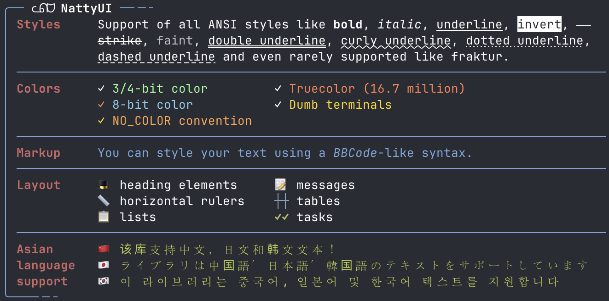

> [!IMPORTANT]  
> I archived this repo here and moved it to [Codeberg](https://codeberg.org/mblumtritt/natty-ui) for several reasons.
> <br/>🛠️ It's still active there!

# NattyUI ​ᓚᕠᗢ 

This is the beautiful, nice, nifty, fancy, neat, pretty, cool, rich, lovely, natty user interface you like to have for your command line applications. It contains elegant, simple and beautiful tools that enhance your command line interfaces functionally and aesthetically.

- Gem: [rubygems.org](https://rubygems.org/gems/natty-ui)
- Source: [codeberg.org](https://codeberg.org/mblumtritt/natty-ui)
- Help: [rubydoc.info](https://rubydoc.info/gems/natty-ui/NattyUI)

## Features



- automatic line break of all text output
- markup of text attributes and colors using a [BBCode](https://en.wikipedia.org/wiki/BBCode) like syntax
- automatic detection if ANSI is available
- support of [NO_COLOR convention](https://no-color.org)
- support of [CSIu input protocol](https://sw.kovidgoyal.net/kitty/keyboard-protocol)
- headings
- text separators
- lists
- various types of text blocks with automatic alignment
- text columns
- tables
- task lists
- progress indicators
- and more!

## Help

📕 See the [online help](https://rubydoc.info/gems/natty-ui/NattyUI) and have a look at the [examples](./examples/) directory to learn from code.

### Run Examples

You can execute all examples by

```shell
ruby ./examples/examples.rb
```

or see the non-ANSI version

```shell
NO_COLOR=1 ruby ./examples/examples.rb
```

## Installation

You can install the gem in your system with

```shell
gem install natty-ui
```

or you can use [Bundler](http://gembundler.com/) to add NattyUI to your own project:

```shell
bundle add natty-ui
```

After that you only need one line of code to have everything together

```ruby
require 'natty-ui'
```
